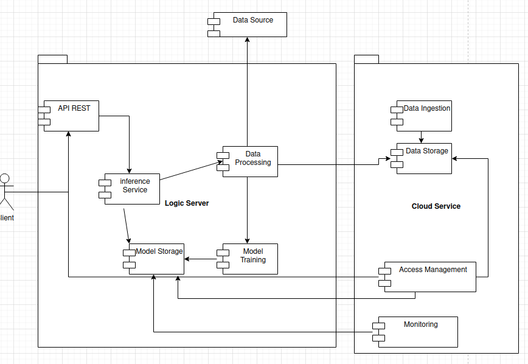

# ABIChallenge_yasser-azan

# FastAPI Project with MVP Pattern

This is a FastAPI project structured using the MVP (Model-View-Presenter) pattern.

## Project Structure

my_fastapi_app/
├── app/
│ ├── init.py
│ ├── main.py
│ ├── models/
│ │ └── init.py
│ │ └── item.py
│ ├── views/
│ │ └── init.py
│ │ └── item_view.py
│ ├── presenters/
│ │ └── init.py
│ │ └── item_presenter.py
│ ├── routes/
│ │ └── init.py
│ │ └── item_route.py
├── Dockerfile
├── docker-compose.yml
├── requirements.txt
└── README.md

## Solution architecture
View of the solution by components


## Running the Project

### Using Docker Compose

1. Build and start the containers:

```sh
   docker-compose up --build
```

### Alternatieve to run local project

```sh
uvicorn app.main:app --reload
```

## Documentation

2. The API will be available at http://localhost:8000.

   Swagger UI: http://localhost:8000/docs
   ReDoc: http://localhost:8000/redoc

3. Using endpoints
   API Endpoints
   GET /: Presentation of project.
   GET /loaddata/: Load data from excel and clean and save in sqlite database 
   GET /unique_variables/: unique_variables  Get the number of unique values ​​per column
   GET /count_by_product/: Examining how many of each product are
   GET /interpreting_data/ data to analize the results
   

